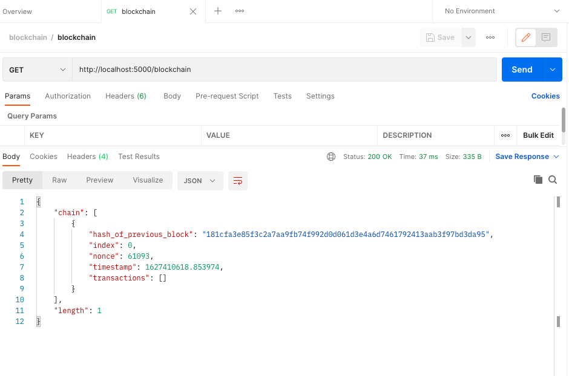
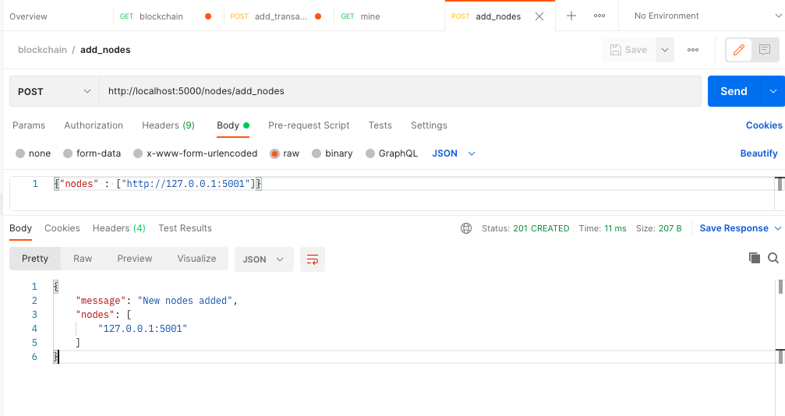
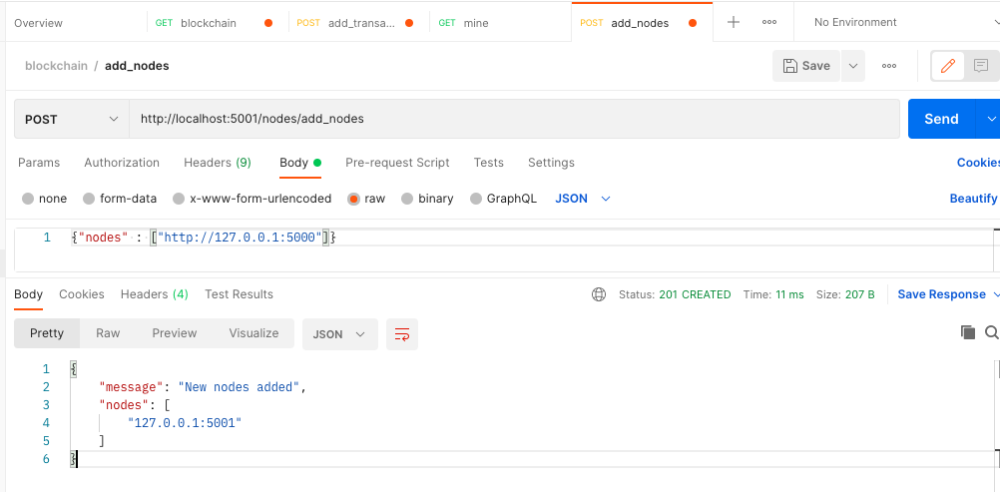
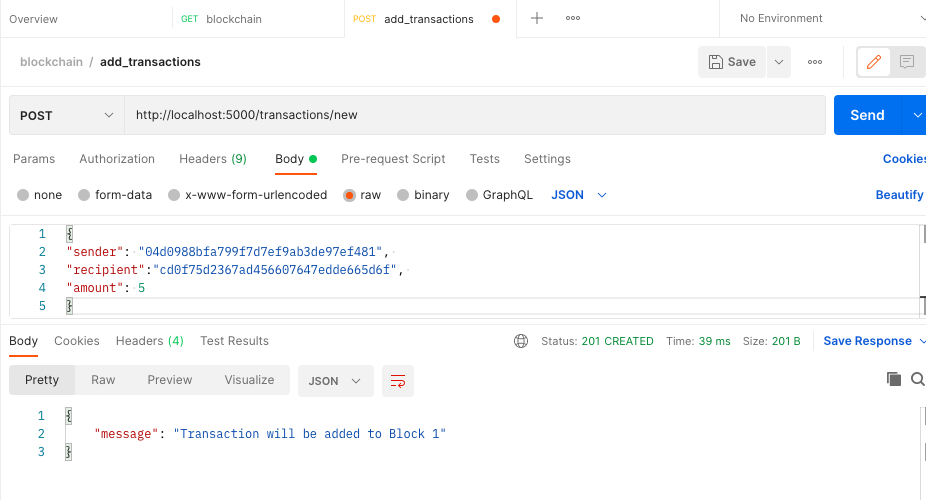
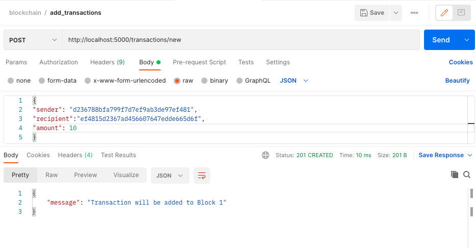
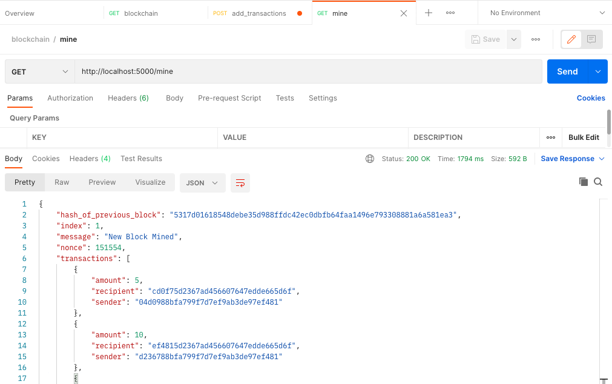
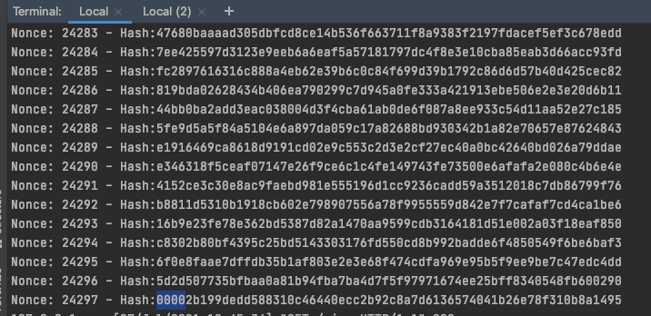
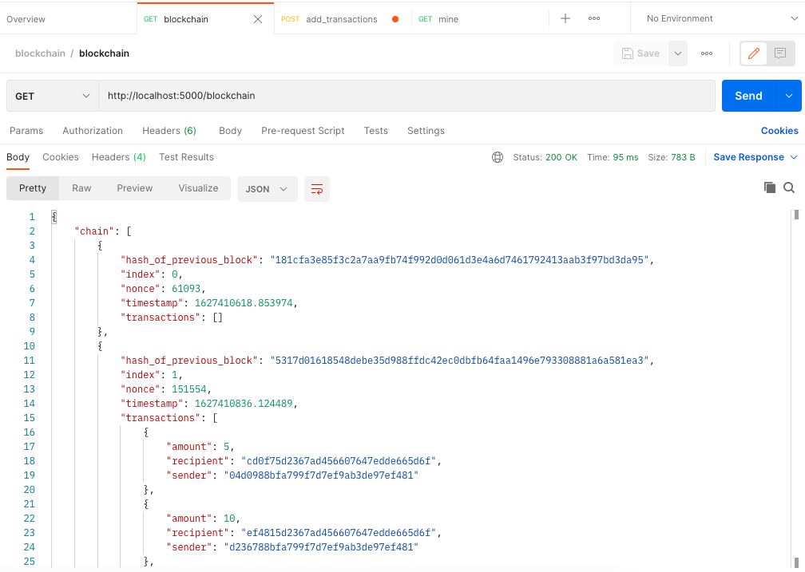
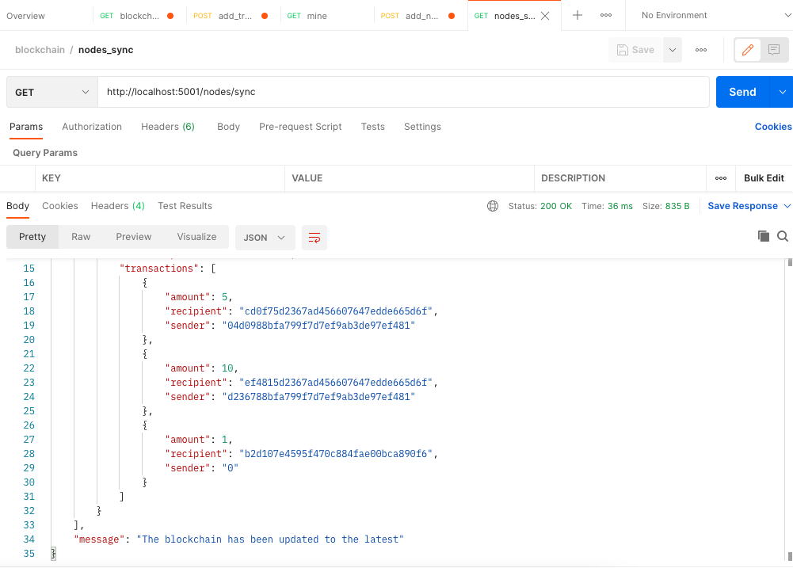

## Conceptual Blockchain Implementation

Conceptual blockchain implementation using Python and use it to illustrate the key concepts.

### Methods:
+ Blockchain initialization
+ Add nodes
+ Sync Nodes
+ Add Transactions
+ Block Mining (find Nonce)
+ Update the Blockchain

### To start the nodes
`python blockchain.py xxxx`  
_each node must have a different port number_  
e.g. `python blockchain.py 5000`  

#### view the content of the  blockchain running on the node_ 
+ http://localhost:5000/blockchain  
or
+ curl http://localhost:5000/blockchain
  

### Example:
+ Initialization:

+ Add Nodes - 1:

+ Add Nodes - 2:

+ Add Transactions - 1:

+ Add Transactions - 2:

+ Mining blocks:

+ Finding the Nonce:

  
+ Reading the Blockhain:

+ Sync Nodes - 1:

+ Sync Nodes - 2:

## Reference:
[Beginning Ethereum Smart Contracts Programming](https://www.amazon.com.mx/Beginning-Ethereum-Smart-Contracts-Programming/dp/1484250850)

---   

